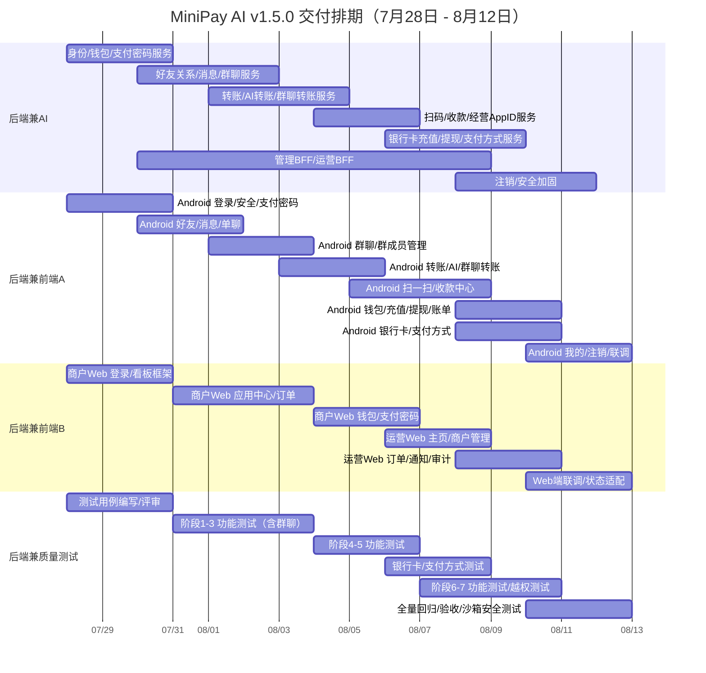

# MiniPay AI 智能支付平台 - 产品需求文档（PRD）

---

## 变更记录

| 版本 | 修订日期 | 修订人 | 修订内容 |
|---|---|---|---|
| V1.0 | 2026-07-28 | — | 初稿 |
| V1.5.0 | 2026-07-30 | — | Android 新增好友消息、扫码收款、经营 AppID、我的与注销；接入支付宝沙箱充值/出款；重构商户和运营平台；Consumer Web/H5 退出本期范围 |
| V1.6.0 | 2026-07-31 | — | 充值提现改为银行卡渠道；支付方式支持多选：支付宝支付、钱包余额支付、微信支付；新增银行卡绑定管理 |
| V1.7.0 | 2026-07-31 | — | 新增群聊功能：创建群聊、群聊会话、群成员@转账；群聊转账逻辑参考微信群聊转账 |

---

## 1. 背景介绍

### 1.1 业务背景

**当前业务现状：**

MiniPay AI 是一个面向作品展示与技术联调的智能支付沙箱平台。平台通过 Android 消费者端、商户 Web 平台和运营 Web 平台，展示从身份认证、社交好友、AI 转账、扫码收款、支付、退款、钱包到运营排查的完整沙箱闭环。充值提现通过银行卡渠道；支付支持支付宝支付、钱包余额和微信支付三种方式。所有资金均为沙箱资产，不产生真实资金流动。

**存在哪些问题或痛点：**

- 传统支付流程依赖用户手动填写收款方信息，操作繁琐，缺乏智能化体验。
- 社交场景下的转账（好友间转账、扫码收款等）缺乏一体化的产品闭环。
- 商户侧缺少自助经营管理能力（应用管理、订单查询、钱包管理等）。
- 运营侧缺少对商户、应用、订单的全局管理和排查工具。
- 沙箱环境下需完整模拟真实支付链路（充值、支付、提现、退款），验证回调签名、幂等、异步状态恢复等关键技术点。

**本次改造/新建的范围：**

本次为 MVP（P0）版本，覆盖以下终端和模块：

| 终端 | 范围 |
|---|---|
| Android App | 登录与安全、AI 主页与侧边栏、好友与消息、群聊、扫一扫与收款、钱包、订单、我的 |
| 商户 Web | 主页看板、应用中心、订单中心、钱包 |
| 运营 Web | 主页看板、商户管理、订单管理 |

**非本期范围：** Consumer Web/H5、iOS、外卖业务、真实资金、分账、部分退款、争议仲裁、朋友圈。

### 1.2 页面原型

C 端原型图已上传至项目仓库，以下为关键页面原型预览（详见各章节内嵌图片）：

| 原型页面 | 对应章节 | 预览链接 |
|---|---|---|
| AI 主页 | 3.2.1 | [查看](https://gitee.com/niukinng/mini-pay-ai-frontend/raw/main/docs/prototypes/%E7%B1%B3%E7%81%B5-%E4%B8%BB%E9%A1%B5.png) |
| 主页侧边栏 | 3.2.1 | [查看](https://gitee.com/niukinng/mini-pay-ai-frontend/raw/main/docs/prototypes/%E7%B1%B3%E7%81%B5%E4%B8%BB%E9%A1%B5%E4%BE%A7%E8%BE%B9%E6%A0%8F.png) |
| 消息中心 | 3.2.3 | [查看](https://gitee.com/niukinng/mini-pay-ai-frontend/raw/main/docs/prototypes/%E7%B1%B3%E7%81%B5%E6%B6%88%E6%81%AF%E4%B8%AD%E5%BF%83.png) |
| 通讯录 | 3.2.4 | [查看](https://gitee.com/niukinng/mini-pay-ai-frontend/raw/main/docs/prototypes/%E7%B1%B3%E7%81%B5%E9%80%9A%E8%AE%AF%E5%BD%95.png) |
| 添加好友 | 3.2.4 | [查看](https://gitee.com/niukinng/mini-pay-ai-frontend/raw/main/docs/prototypes/%E7%B1%B3%E7%81%B5-%E6%B7%BB%E5%8A%A0%E5%A5%BD%E5%8F%8B.png) |
| 钱包 | 3.2.7 | [查看](https://gitee.com/niukinng/mini-pay-ai-frontend/raw/main/docs/prototypes/%E7%B1%B3%E7%81%B5%E9%92%B1%E5%8C%85.png) |
| 个人中心 | 3.2.8 | [查看](https://gitee.com/niukinng/mini-pay-ai-frontend/raw/main/docs/prototypes/%E7%B1%B3%E7%81%B5%E4%B8%AA%E4%BA%BA%E4%B8%AD%E5%BF%83.png) |
| 编辑资料 | 3.2.8 | [查看](https://gitee.com/niukinng/mini-pay-ai-frontend/raw/main/docs/prototypes/%E7%B1%B3%E7%81%B5%E7%BC%96%E8%BE%91%E4%B8%AA%E4%BA%BA%E4%BF%A1%E6%81%AF.jpg) |
| 订单 | 3.2.8 | [查看](https://gitee.com/niukinng/mini-pay-ai-frontend/raw/main/docs/prototypes/%E7%B1%B3%E7%81%B5%E8%AE%A2%E5%8D%95.png) |
| 长期记忆 | 3.2.8 | [查看](https://gitee.com/niukinng/mini-pay-ai-frontend/raw/main/docs/prototypes/%E7%B1%B3%E7%81%B5%E8%AE%B0%E5%BF%86.png) |
| 运营主页 | 3.3.3 | [查看](https://gitee.com/niukinng/mini-pay-ai-frontend/raw/main/docs/prototypes/%E8%BF%90%E8%90%A5%E4%B8%BB%E9%A1%B5.png) |
| 商户管理-商户列表 | 3.3.3 | [查看](https://gitee.com/niukinng/mini-pay-ai-frontend/raw/main/docs/prototypes/%E5%95%86%E6%88%B7%E7%AE%A1%E7%90%86-%E5%95%86%E6%88%B7%E5%88%97%E8%A1%A8%E9%A1%B5%E9%9D%A2.png) |
| 商户管理-应用列表 | 3.3.3 | [查看](https://gitee.com/niukinng/mini-pay-ai-frontend/raw/main/docs/prototypes/%E5%95%86%E6%88%B7%E7%AE%A1%E7%90%86-%E5%BA%94%E7%94%A8%E5%88%97%E8%A1%A8.png) |
| 支付订单 | 3.3.3 | [查看](https://gitee.com/niukinng/mini-pay-ai-frontend/raw/main/docs/prototypes/%E8%AE%A2%E5%8D%95%E7%AE%A1%E7%90%86-%E6%94%AF%E4%BB%98%E8%AE%A2%E5%8D%95%E9%A1%B5%E9%9D%A2.png) |
| 退款订单 | 3.3.3 | [查看](https://gitee.com/niukinng/mini-pay-ai-frontend/raw/main/docs/prototypes/%E8%AE%A2%E5%8D%95%E7%AE%A1%E7%90%86-%E9%80%80%E6%AC%BE%E8%AE%A2%E5%8D%95.png) |
| 转账订单 | 3.3.3 | [查看](https://gitee.com/niukinng/mini-pay-ai-frontend/raw/main/docs/prototypes/%E8%AE%A2%E5%8D%95%E7%AE%A1%E7%90%86-%E8%BD%AC%E8%B4%A6%E8%AE%A2%E5%8D%95.png) |
| 商户通知 | 3.3.3 | [查看](https://gitee.com/niukinng/mini-pay-ai-frontend/raw/main/docs/prototypes/%E8%AE%A2%E5%8D%95%E7%AE%A1%E7%90%86-%E5%95%86%E6%88%B7%E9%80%9A%E7%9F%A5.png) |
| 商户主页看板 | 3.3.2 | [查看](https://gitee.com/niukinng/mini-pay-ai-frontend/raw/main/docs/prototypes/%E5%95%86%E6%88%B7%E4%B8%BB%E9%A1%B5.png) |
| 商户应用管理 | 3.3.2 | [查看](https://gitee.com/niukinng/mini-pay-ai-frontend/raw/main/docs/prototypes/%E5%BA%94%E7%94%A8%E7%AE%A1%E7%90%86.png) |
| 商户支付订单 | 3.3.2 | [查看](https://gitee.com/niukinng/mini-pay-ai-frontend/raw/main/docs/prototypes/%E8%AE%A2%E5%8D%95%E7%AE%A1%E7%90%86-%E6%94%AF%E4%BB%98%E8%AE%A2%E5%8D%95.png) |
| 商户退款订单 | 3.3.2 | [查看](https://gitee.com/niukinng/mini-pay-ai-frontend/raw/main/docs/prototypes/%E5%95%86%E6%88%B7%E9%80%80%E6%AC%BE%E8%AE%A2%E5%8D%95.png) |
| 商户转账订单 | 3.3.2 | [查看](https://gitee.com/niukinng/mini-pay-ai-frontend/raw/main/docs/prototypes/%E5%95%86%E6%88%B7%E8%BD%AC%E8%B4%A6%E8%AE%A2%E5%8D%95.png) |
| 商户钱包 | 3.3.2 | [查看](https://gitee.com/niukinng/mini-pay-ai-frontend/raw/main/docs/prototypes/%E9%92%B1%E5%8C%85.png) |

---

## 2. 产品概述

### 2.1 产品逻辑

**核心业务流程：**

1. **登录与开户：** 用户通过手机号 + 验证码登录，首次登录原子创建用户和沙箱钱包，发放 ¥10,000.00 初始沙箱资产，设置 6 位支付密码。
2. **AI 转账：** 用户在 AI 对话中用自然语言描述转账意图，AI 补齐收款人、金额、备注等信息并生成确认卡，用户选择支付方式（支付宝/钱包余额/微信支付）后跳转确认页输入支付密码完成付款。
3. **社交转账：** 添加好友后建立双向关系，在单聊会话中发起转账，选择支付方式，输入支付密码后即时到账，会话中生成脱敏转账卡片。
4. **群聊转账：** 用户可创建群聊并邀请好友加入，群内任一成员可@指定群成员发起转账，转账为双方私密交易，群内仅展示脱敏转账卡片，不暴露金额和支付详情。
5. **扫码付款：** 扫一扫识别好友码、个人收款码或经营收款码；个人码走站内转账，经营码生成支付订单。扫码后进入付款确认页，支持选择支付方式。
6. **充值提现闭环：** 充值通过银行卡转入沙箱余额；提现需先绑定银行卡，校验余额、支付密码和银行卡后冻结余额，异步出款至绑定银行卡；支持失败恢复。所有资金页面标注沙箱提示。
7. **商户管理：** 商户管理员查看经营看板、管理应用（CRUD/启停）、查询订单、管理商户钱包。
8. **运营管理：** 运营人员管理商户和应用（启停/审计）、全局查询订单、排查商户通知。

**各模块之间的关联关系：**

```
消费者（Android）
  ├── AI 对话 → 转账确认 → 支付密码 → 钱包扣款
  ├── 好友消息 → 单聊会话 → 转账卡片
  ├── 群聊 → @成员转账 → 私密转账卡片
  ├── 扫一扫 → 个人码/经营码 → 转账/支付订单
  ├── 钱包 → 充值/提现/转账/账单
  └── 我的 → 订单/记忆/授权/注销

商户（Web）
  ├── 看板 ← 支付/退款订单聚合
  ├── 应用中心 → 经营 AppID → 经营收款码
  ├── 订单中心 ← 支付/退款/转账订单
  └── 钱包 → 充值/提现/转账

运营（Web）
  ├── 商户管理 ← 商户 CRUD/启停
  ├── 应用管理 ← 应用 CRUD/启停
  ├── 订单管理 ← 全局订单查询
  └── 商户通知 ← 回调排查
```

### 2.2 信息架构

**系统分为哪几个大模块：**

| 模块 | 说明 |
|---|---|
| Android 消费者端 | 面向 C 端用户，提供 AI 转账、好友社交、群聊、扫码收款、钱包管理、个人中心等功能 |
| 商户 Web 平台 | 面向商户管理员，提供经营看板、应用管理、订单管理、钱包管理等功能 |
| 运营 Web 平台 | 面向支付运营人员，提供商户管理、应用管理、全局订单查询、通知排查等功能 |
| 后端服务 | 微服务架构：identity-service（身份）、payment-service（支付）、wallet-service（钱包）、agent-service（AI）、consumer-bff（消费者网关）、management-bff（管理网关） |

**前台/后台的划分：**

| 类型 | 终端 | 用户角色 |
|---|---|---|
| 前台 | Android App | 消费者 |
| 前台 | 商户 Web | 商户管理员 |
| 后台 | 运营 Web | 支付运营人员 |

### 2.3 角色术语

| 角色/术语 | 定义 | 场景说明 |
|---|---|---|
| 消费者 | 使用 Android App 进行 AI 转账、好友聊天、扫码收款的 C 端用户 | 登录、转账、添加好友、扫码付款等场景 |
| 商户管理员 | 管理所属商户应用、订单和钱包的管理角色 | 查看经营数据、管理应用、处理订单等场景 |
| 支付运营人员 | 管理平台商户和应用、全局排查订单的运营角色 | 商户审核、订单排查、通知处理等场景 |
| MiniPay 经营 AppID | MiniPay 内部签发的经营应用标识，非支付宝开放平台 AppID | 经营收款码关联、支付订单归属 |
| 支付宝沙箱 AppID | 平台后端统一配置的支付宝沙箱接口标识 | 支付宝支付渠道的验签回调 |
| 支付密码 | 6 位数字密码，用于资金操作授权，与登录凭据隔离 | 转账、充值、提现等资金操作确认 |
| MiniPay 号 | 系统生成的唯一标识，可用于好友搜索 | 添加好友时搜索 |
| 提现 | 将 MiniPay 沙箱余额通过银行渠道转出至绑定银行卡，不产生真实资金 | 钱包余额提现到银行卡 |
| 好友码 | 用户个人二维码，用于快速添加好友 | 扫一扫添加好友 |
| 个人收款码 | 使用签名令牌的个人收款二维码，不暴露用户 ID | 面对面个人收款 |
| 经营收款码 | 关联 MiniPay AppID 的收款二维码，生成支付订单 | 商户经营收款 |
| 群聊 | 三人及以上多人会话，支持文本消息和群内转账 | 多人会话、@指定成员转账 |
| 群聊转账 | 群内成员之间的一对一私密转账，仅交易双方可见详情 | 群聊中@成员发起转账 |

---

## 3. 需求说明

### 3.1 需求列表

| 需求编号 | 需求名称 | 优先级 | 状态 | 备注 |
|---|---|---|---|---|
| REQ-001 | Android 登录与安全 | P0 | 待开发 | 手机号登录、验证码、支付密码设置 |
| REQ-002 | AI 主页与侧边栏 | P0 | 待开发 | AI 对话、会话管理、转账意图识别 |
| REQ-003 | 好友、消息与群聊 | P0 | 待开发 | 好友申请/列表/详情、单聊、群聊、离线消息 |
| REQ-004 | 转账与 AI 转账 | P0 | 待开发 | 站内转账、单聊转账、群聊转账、AI 转账确认 |
| REQ-005 | 扫一扫与收款 | P0 | 待开发 | 三类码识别、个人/经营收款、AppID 开通 |
| REQ-006 | 钱包管理 | P0 | 待开发 | 余额、充值、提现、转账、账单、银行卡管理 |
| REQ-007 | 我的与注销 | P0 | 待开发 | 资料编辑、订单、长期记忆、授权、银行卡、注销 |
| REQ-008 | 商户 Web 平台 | P0 | 待开发 | 看板、应用中心、订单中心、钱包 |
| REQ-009 | 运营 Web 平台 | P0 | 待开发 | 商户管理、应用管理、订单管理、通知 |
| REQ-010 | 银行卡收付对接 | P0 | 待开发 | 银行卡充值回调、提现异步出款、支付渠道验签、幂等处理 |
| REQ-011 | 群聊功能 | P0 | 待开发 | 创建群聊、群聊会话、群成员管理、群聊转账 |

### 3.2 前台需求明细

**当前系统分为：** Android 消费者端（前台）、商户 Web（前台管理）、运营 Web（后台管理）。

**角色权限分为：** 消费者（前台访问人员）、商户管理员（前台管理人员）、支付运营人员（后台管理员）。

以下内容仅包含需求说明功能，页面布局样式可由 UED 重新调整。

---

#### 3.2.1 AI 主页与侧边栏（APP-03 / APP-04）

**页面功能概述：** AI 主页为消费者提供自然语言转账交互入口，用户通过文字描述转账意图，AI 自动补齐收款人、金额和备注信息并生成确认卡。侧边栏管理历史 AI 会话。

**补充说明：** AI 只允许搜索好友、补齐信息并创建转账准备单，不得确认付款。支付密码不进入 AI 上下文。

| 模块 | 需求说明 | 图示 |
|---|---|---|
| AI 对话流 | 展示 AI 消息流和用户输入，支持文本输入框和推荐问题快捷入口。AI 匹配好友时：无匹配/多匹配/缺金额时继续追问；信息完整后生成确认卡并跳转 APP-13/APP-09。 |  |
| 顶部导航 | 右上角消息图标（跳转 APP-18 消息列表）和"+"按钮（展开扫一扫、收款、添加朋友）。 |  |
| 侧边栏 | 右划打开，支持新建会话、搜索、选择、重命名、删除 AI 会话。底部"我的"入口跳转 APP-17。删除需二次确认。 |  |

**AI 主页详细说明：**

1. 用户输入自然语言转账描述（如"转 100 元给小明"），AI 先匹配好友列表。
2. 无匹配结果时，AI 提示用户检查姓名或使用手机号/MiniPay 号搜索。
3. 多个匹配结果时，AI 列出候选项让用户选择。
4. 缺少金额时，AI 追问具体金额。
5. 信息完整后，AI 生成转账确认卡（展示收款人、金额、备注），用户点击跳转 APP-09 付款确认页。
6. AI 对话中不接收、不存储、不传递支付密码。


---

#### 3.2.2 登录与安全（APP-01 / APP-02 / APP-02A）

**页面功能概述：** 消费者通过手机号 + 6 位验证码登录，首次登录设置 6 位支付密码。

| 模块 | 需求说明 | 图示 |
|---|---|---|
| 手机号登录（APP-01） | 输入 11 位中国大陆手机号，勾选用户协议，点击"下一步"进入验证码页。 | （待补充） |
| 验证码（APP-02） | 6 位演示验证码输入，60 秒倒计时后可重发。单次最多校验 5 次，超限锁定 10 分钟。首次用户进入 APP-02A，其他用户进入 APP-03。 | （待补充） |
| 支付密码设置（APP-02A） | 输入并二次确认 6 位数字支付密码，不回显、不复制。成功进入 APP-03。 | （待补充） |

**需求说明：**

1. 首次登录原子创建用户和沙箱钱包，仅发放一次 ¥10,000.00 初始沙箱资产。
2. 资金操作前必须已设置支付密码；支付密码与登录凭据隔离。
3. 修改支付密码前需重新完成短信验证。

---

#### 3.2.3 消息列表、单聊与群聊（APP-18 / APP-19 / APP-32）

**页面功能概述：** 消息列表统一展示单聊和群聊会话，按最后消息时间倒序排列。进入单聊或群聊会话后可收发文本消息和查看转账卡片。

**需求说明：**

1. 点击顶栏消息图标进入消息列表页。
2. 列表展示字段：对方头像（单聊）/群头像（群聊）、名称、最后一条消息摘要、时间、未读红点、会话类型标识。
3. 列表按最后消息时间倒序排列，单聊与群聊混合排序。
4. 每页最多展示 50 条会话，支持滚动加载。
5. 只有有效好友可创建一对一会话；同一对好友只有一个有效单聊会话。
6. P0 消息类型仅为文本、系统提示和转账卡片；文本最多 1,000 字。
7. 客户端消息 ID 保证重试幂等；离线消息持久化，未读数按服务端已读游标计算。
8. 删除好友后不能发送新消息，但双方仍可查看历史会话。
9. 退出群聊后不再接收新消息，仍可查看历史群聊记录。


---

#### 3.2.4 好友列表与添加好友（APP-20 / APP-21 / APP-22）

**页面功能概述：** 好友列表展示所有已建立双向好友关系的联系人。支持按完整手机号、MiniPay 号或好友码搜索添加好友。

**需求说明：**

1. 好友列表展示好友头像、昵称、MiniPay 号，点击进入好友详情（APP-22）。
2. 添加好友必须发送申请，对方接受后建立唯一双向好友关系。
3. 拒绝或过期不建立关系。删除好友后重新添加不创建重复会话。
4. 可通过扫一扫识别好友码快速添加。


---

#### 3.2.5 群聊（APP-32 / APP-33 / APP-34）

**页面功能概述：** 群聊为多人会话功能，用户可创建群聊并邀请好友加入。群内成员可收发消息，并支持@指定群成员发起转账。转账逻辑参考微信群聊转账：转账为双方私密交易，群内仅展示脱敏转账卡片。

| 模块 | 需求说明 | 图示 |
|---|---|---|
| 群聊列表入口 | 消息列表顶部"+"按钮中新增"发起群聊"入口，或在好友详情页发起群聊。 | （待补充） |
| 创建群聊（APP-34） | 从好友列表中选择至少 2 位好友组成群聊，设置群名称（2～20 字）。创建者自动成为群主。群聊创建后生成唯一群会话，所有成员自动加入。 | （待补充） |
| 群聊会话（APP-32） | 群内消息流展示：发送者头像、昵称、消息内容、时间。支持文本消息和转账卡片两种消息类型。群成员头像默认取前 9 位组合为群头像。 | （待补充） |
| 群聊详情/成员管理（APP-33） | 展示群名称、群头像、成员列表。群主可添加/移除成员、解散群聊。任一成员可主动退出群聊。成员列表支持搜索和@提及。 | （待补充） |
| 群聊转账（APP-32 → APP-09） | 群成员在输入框中@指定一位群成员，选择"转账"操作，输入金额和备注后跳转 APP-09 付款确认。转账为双方私密交易，群内仅生成脱敏转账卡片（展示"XX 向 XX 发起一笔转账"），不暴露金额、支付方式和支付密码。 | （待补充） |

**群聊详细需求说明：**

1. 群聊创建者默认为群主，群主可转让给群内任一成员。
2. 群成员上限 200 人，群聊数量无限制。
3. 群名称支持修改（群主或全员可修改，由群设置控制）。
4. 移除成员或退出群聊后，该成员不再接收新消息，但保留历史记录。
5. 解散群聊后所有成员停止收发消息，历史记录保留可查看。
6. 群聊转账规则（参考微信群聊转账）：
   - ① 群内任一成员可@指定另一成员发起转账，双方必须为好友关系。
   - ② 转账为双方私密交易：仅付款方和收款方可见金额、支付方式和转账详情。
   - ③ 群聊中仅展示脱敏转账卡片，格式为"XX 向 XX 发起一笔转账"，点击卡片跳转订单详情（仅交易双方可见完整信息，第三方提示"你不在本次交易中"）。
   - ④ 转账金额、支付密码等敏感信息不进入群消息流。
   - ⑤ 群聊转账与单聊转账共用同一付款确认页（APP-09）和支付流程。

（群聊原型图待补充）

---

#### 3.2.6 扫一扫与收款（APP-23 / APP-14 系列）

**页面功能概述：** 扫一扫识别 MiniPay 好友码、个人收款码和经营收款码，根据码类型分流到不同业务处理。收款中心管理个人收款码、经营收款码和收款记录。

| 模块 | 需求说明 | 图示 |
|---|---|---|
| 扫一扫（APP-23） | 调用摄像头扫描二维码，仅识别三类 MiniPay 码。好友码跳转好友详情；个人收款码跳转转账页（付款方输入金额）；经营收款码跳转支付页。未知、篡改、失效或停用码均拒绝。 | （待补充） |
| 收款中心（APP-14） | 展示个人收款码、经营收款码入口、收款记录入口。 | （待补充） |
| 个人收款码（APP-14A） | 生成使用签名令牌的个人收款码，不暴露用户 ID。支持保存到相册。 | （待补充） |
| 经营 AppID 开通（APP-14C） | 自助开通，仅需填写经营名称（2～40 字）并同意沙箱协议，即时生效。 | （待补充） |
| 经营收款码（APP-14D） | 关联 MiniPay AppID 的动态收款码，扫码付款生成支付订单。AppID 停用后对应码立即不可用。 | （待补充） |
| 收款记录（APP-14B） | 按个人转账收款和经营支付收款区分，支持时间、类型和状态筛选。 | （待补充） |

（原型图待补充）

---

#### 3.2.7 钱包、充值、提现、转账、账单（APP-11 / APP-12 / APP-13 / APP-30 / APP-09 / APP-15）

**页面功能概述：** 钱包为资金管理核心入口，展示可用余额和冻结余额，提供充值、提现、转账和账单查询功能。付款确认页为转账/支付的最终确认步骤。

| 模块 | 需求说明 | 图示 |
|---|---|---|
| 钱包（APP-11） | 展示可用余额、冻结余额，操作入口：充值、提现、转账、账单。所有页面展示沙箱提示："MiniPay 沙箱资产，仅用于功能体验，不产生真实资金。" |  |
| 充值（APP-12） | 输入金额（单笔上限 ¥10,000.00），选择已绑定的银行卡作为充值来源，创建充值单并调用银行网关完成扣款。仅银行回调成功的通知触发入账，重复通知不重复入账。充值后余额上限 ¥20,000.00。 | （待补充） |
| 转账（APP-13） | 选择收款人（好友）、输入金额、备注（最多 50 字），提交后跳转 APP-09 付款确认。不得向本人转账。 | （待补充） |
| 付款确认（APP-09） | 展示收款人、金额、备注、支付方式和沙箱提示。**支付方式：** 支付宝支付（唤起支付宝沙箱）、钱包余额支付（默认）、微信支付（唤起微信沙箱）。选定支付方式后输入 6 位支付密码，获得 60 秒单次授权。成功即时到账，处理中等待 30 秒后引导到账单查询。 | （待补充） |
| 提现（APP-30） | **前置条件：** 需先绑定银行卡（姓名、银行卡号、开户行）。提现流程：校验余额、支付密码、银行卡状态和银行渠道状态，冻结余额后异步调用银行网关出款至绑定银行卡。成功扣减记账；明确失败释放冻结；结果不确定保持处理中由后台恢复。渠道不可用时明确失败："银行转账能力暂不可用，本次未完成出款，资金不会丢失。" | （待补充） |
| 银行卡管理（APP-31） | 支持绑定、查看、解绑银行卡。绑定需填写：持卡人姓名、银行卡号、开户行。解绑需校验支付密码，且无处理中提现方可操作。银行卡信息脱敏展示（仅显示后四位）。 | （待补充） |
| 账单（APP-15） | 按时间、类型、状态筛选交易记录。默认最近 30 天，单次范围最长 365 天。支持分页。 | （待补充） |

**需求说明：**

1. 金额以人民币元展示，后端以整数分结算。
2. 单笔充值/转账/提现上限 ¥10,000.00，充值后余额上限 ¥20,000.00。
3. 处理中的同一笔转账不得重复发起。
4. 所有资金操作必须输入支付密码。
5. 支付方式三选一：支付宝支付（沙箱，验签回调）、钱包余额支付（即时扣款）、微信支付（沙箱，验签回调）。

**银行卡管理需求说明：**

1. 提现前必须先绑定至少一张银行卡。
2. 绑定字段：持卡人姓名、银行卡号（16-19 位数字）、开户行（下拉选择）。
3. 银行卡号仅显示后四位，其余脱敏为 `****`。
4. 解绑前需校验支付密码，且无处理中的提现记录。
5. 每人最多绑定 3 张银行卡。
6. 银行卡信息不得进入 AI 上下文或会话消息。


---

#### 3.2.8 我的、编辑资料、订单、长期记忆、授权管理、银行卡管理、账号注销（APP-17 / APP-24～31）

**页面功能概述：** "我的"为个人中心入口，聚合资料管理、订单查询、长期记忆、授权管理、银行卡管理和账号注销等功能。

| 模块 | 需求说明 | 图示 |
|---|---|---|
| 我的（APP-17） | 展示头像、昵称、MiniPay 号，入口：编辑资料、订单列表、银行卡管理、长期记忆、授权管理、账号注销、退出登录。 |  |
| 编辑资料（APP-24） | 修改头像、昵称（2～20 字，允许中文/字母/数字/下划线，内容安全校验）。MiniPay 号只读。 |  |
| 订单列表（APP-25） | 展示所有支付/转账/充值/提现订单，支持按类型和状态筛选、分页。点击进入订单详情（APP-26）。 |  |
| 长期记忆（APP-27） | AI 长期记忆管理，用户可查看和删除已存储的记忆条目。 |  |
| 授权管理（APP-28） | 第三方授权管理占位页，展示"暂未接入可授权的外部平台。" | （待补充） |
| 银行卡管理（APP-31） | 绑卡列表（卡号后四位、开户行、绑定时间），支持添加、解绑银行卡。添加需填姓名/卡号/开户行；解绑需校验支付密码，处理中提现不可解绑。最多 3 张。 | （待补充） |
| 账号注销（APP-29） | 余额为零且无处理中交易方可提交注销。进入 7 天冷静期，期间禁止新增资金交易，可重新验证后撤销。冷静期结束后撤销会话、停止登录并匿名化个人资料；账本和订单记录保留。 | （待补充） |

---

### 3.3 后台配置需求明细

#### 3.3.1 后台管理列表

| 模块 | 需求说明 |
|---|---|
| 商户 Web - 看板 | 展示今日交易金额、累计交易金额/笔数、收款/退款金额与笔数趋势。默认最近 7 天，可切 30 天。标明统计时区和更新时间。图表无数据时显示空态。 |
| 商户 Web - 应用中心 | 应用列表、查询、新建、编辑、详情、启停、删除。AppID 系统生成只读。有历史交易只能停用不能物理删除。 |
| 商户 Web - 订单中心 | 支付订单、退款记录、转账订单的筛选、分页、列表和详情。退款仅成功支付且无处理中/成功退款时可操作。 |
| 商户 Web - 钱包 | 可用/冻结余额展示，充值、提现、转账操作，近期账单。写操作要求幂等键和二次确认。 |
| 运营 Web - 主页 | 平台交易金额/笔数、成功率、退款金额、活跃商户、待处理事项、趋势图。所有指标标明范围、口径和更新时间。 |
| 运营 Web - 商户管理 | 商户列表、详情、新建、编辑、启停、删除。有应用/交易只能停用。操作写入审计日志。 |
| 运营 Web - 应用管理 | 应用列表、详情、新建、编辑、启停、删除。强制展示所属商户。有交易只能停用。 |
| 运营 Web - 订单管理 | 支付订单、退款记录、转账订单的全局查询和详情。个人信息脱敏，只读。不提供手工改余额或状态。 |
| 运营 Web - 商户通知 | 通知列表、详情、请求/响应摘要、重试历史。不展示密钥或完整敏感报文。 |

#### 3.3.2 商户 Web - 页面与字段

##### 商户登录（MER-01）

| 字段 | 适用环境 | 适用范围 | 字段简要说明 |
|---|---|---|---|
| 账号 | 中文 | 全部 | 商户管理员账号 |
| 密码 | 中文 | 全部 | 登录密码，与支付密码隔离 |
| 验证码 | 中文 | 全部 | 图形验证码 |

登录失败不暴露账号存在性。

##### 商户主页看板（MER-02）

| 指标 | 适用环境 | 适用范围 | 字段简要说明 |
|---|---|---|---|
| 今日交易金额 | 中文 | 全部 | 当前统计时区自然日内支付成功金额 |
| 累计交易金额 | 中文 | 全部 | 自商户创建以来成功支付累计值 |
| 累计笔数 | 中文 | 全部 | 自商户创建以来成功支付订单总数 |
| 收款趋势 | 中文 | 全部 | 按日统计支付成功金额和笔数 |
| 退款趋势 | 中文 | 全部 | 按日统计退款成功金额和笔数 |

默认最近 7 天，可切换 30 天。


##### 应用中心（MER-03）

| 字段 | 适用环境 | 适用范围 | 字段简要说明 |
|---|---|---|---|
| 应用名称 | 中文 | 全部 | 商户自定义应用名称 |
| MiniPay AppID | 中文 | 全部 | 系统生成，唯一，只读 |
| 应用状态 | 中文 | 全部 | ACTIVE / DISABLED |
| 创建时间 | 中文 | 全部 | 应用创建时间 |

支持增/删/改/查。有历史交易只能停用；仅在无历史交易且为草稿时可物理删除。


##### 支付订单（MER-04）

| 字段 | 适用环境 | 适用范围 | 字段简要说明 |
|---|---|---|---|
| 订单号 | 中文 | 全部 | 系统生成唯一订单号 |
| 交易金额 | 中文 | 全部 | 以元展示，最多两位小数 |
| 订单状态 | 中文 | 全部 | 见状态枚举表 |
| 付款方信息 | 中文 | 全部 | 脱敏展示 |
| 创建时间 | 中文 | 全部 | 订单创建时间 |
| 支付方式 | 中文 | 全部 | 支付宝支付 / 钱包余额 / 微信支付，三选一 |
| 交易渠道 | 中文 | 全部 | 记录实际扣款渠道（ALIPAY / WALLET / WECHAT） |
| 回调摘要 | 中文 | 全部 | 支付宝/微信回调关键信息摘要 |

支持筛选：时间范围、订单状态、支付方式。每页默认 20 条，可分页。


##### 退款记录（MER-05）

| 字段 | 适用环境 | 适用范围 | 字段简要说明 |
|---|---|---|---|
| 退款单号 | 中文 | 全部 | 系统生成唯一退款单号 |
| 原订单号 | 中文 | 全部 | 关联支付订单号 |
| 退款金额 | 中文 | 全部 | 元展示 |
| 退款状态 | 中文 | 全部 | PROCESSING / SUCCEEDED / FAILED |
| 失败原因 | 中文 | 全部 | 退款失败时的原因描述 |

仅成功支付且无处理中/成功退款时可操作。


##### 转账订单（MER-06）

| 字段 | 适用环境 | 适用范围 | 字段简要说明 |
|---|---|---|---|
| 转账单号 | 中文 | 全部 | 系统生成唯一转账单号 |
| 付款方 | 中文 | 全部 | 脱敏展示 |
| 收款方 | 中文 | 全部 | 脱敏展示 |
| 转账金额 | 中文 | 全部 | 元展示 |
| 转账状态 | 中文 | 全部 | 见状态枚举表 |

支持筛选：时间范围、订单状态。每页默认 20 条，可分页。


##### 商户钱包（MER-07 / MER-08）

| 字段 | 适用环境 | 适用范围 | 字段简要说明 |
|---|---|---|---|
| 可用余额 | 中文 | 全部 | 当前可使用的沙箱余额 |
| 冻结余额 | 中文 | 全部 | 处理中交易冻结的金额 |
| 充值金额 | 中文 | 全部 | 单笔上限 ¥10,000.00 |
| 提现金额 | 中文 | 全部 | 需校验余额、支付密码、银行卡和渠道状态 |
| 银行卡号 | 中文 | 全部 | 脱敏仅显示后四位，提现出款目标卡 |
| 转账对象 | 中文 | 全部 | 收款方标识 |
| 支付密码 | 中文 | 全部 | 6 位数字，不回显 |


#### 3.3.3 运营 Web - 页面与字段

##### 运营主页（OPS-02）


| 指标 | 适用环境 | 适用范围 | 字段简要说明 |
|---|---|---|---|
| 平台交易金额 | 中文 | 全部 | 全平台支付成功金额汇总 |
| 交易笔数 | 中文 | 全部 | 全平台支付成功笔数 |
| 成功率 | 中文 | 全部 | 成功笔数 / 总提交笔数 |
| 退款金额 | 中文 | 全部 | 全平台退款成功金额 |
| 活跃商户 | 中文 | 全部 | 统计周期内有交易的商户数 |
| 待处理事项 | 中文 | 全部 | 异常订单、通知失败等 |

##### 商户管理（OPS-03）

| 字段 | 适用环境 | 适用范围 | 字段简要说明 |
|---|---|---|---|
| 商户名称 | 中文 | 全部 | 商户注册名称 |
| 商户状态 | 中文 | 全部 | ACTIVE / DISABLED |
| 关联应用数 | 中文 | 全部 | 该商户下的应用数量 |
| 创建时间 | 中文 | 全部 | 商户创建时间 |

支持增/删/改/查。有应用/交易只能停用。高风险操作写入审计日志。


##### 应用管理（OPS-04）

| 字段 | 适用环境 | 适用范围 | 字段简要说明 |
|---|---|---|---|
| 应用名称 | 中文 | 全部 | 商户自定义应用名称 |
| MiniPay AppID | 中文 | 全部 | 系统生成，唯一，只读 |
| 所属商户 | 中文 | 全部 | 关联商户名称 |
| 应用状态 | 中文 | 全部 | ACTIVE / DISABLED |
| 创建时间 | 中文 | 全部 | 应用创建时间 |

支持增/删/改/查。有交易只能停用。强制展示所属商户。


##### 支付订单（OPS-05）

| 字段 | 适用环境 | 适用范围 | 字段简要说明 |
|---|---|---|---|
| 订单号 | 中文 | 全部 | 全局唯一 |
| 所属商户 | 中文 | 全部 | 关联商户名称 |
| 交易金额 | 中文 | 全部 | 元展示 |
| 状态轨迹 | 中文 | 全部 | 订单完整状态变更历史 |
| 付款方/收款方 | 中文 | 全部 | 脱敏展示 |

只读排查。个人敏感信息脱敏。危险重试操作需单独权限。


##### 退款记录（OPS-06）

| 字段 | 适用环境 | 适用范围 | 字段简要说明 |
|---|---|---|---|
| 退款单号 | 中文 | 全部 | 系统生成唯一退款单号 |
| 原订单号 | 中文 | 全部 | 关联支付订单号 |
| 退款金额 | 中文 | 全部 | 元展示 |
| 退款状态 | 中文 | 全部 | PROCESSING / SUCCEEDED / FAILED |
| 失败原因 | 中文 | 全部 | 退款失败时的原因描述 |


##### 转账订单（OPS-07）

| 字段 | 适用环境 | 适用范围 | 字段简要说明 |
|---|---|---|---|
| 转账单号 | 中文 | 全部 | 系统生成唯一转账单号 |
| 付款方 | 中文 | 全部 | 脱敏展示 |
| 收款方 | 中文 | 全部 | 脱敏展示 |
| 转账金额 | 中文 | 全部 | 元展示 |
| 转账状态 | 中文 | 全部 | 见状态枚举表 |


##### 商户通知（OPS-08）

| 字段 | 适用环境 | 适用范围 | 字段简要说明 |
|---|---|---|---|
| 通知类型 | 中文 | 全部 | 支付回调、退款回调等 |
| 通知状态 | 中文 | 全部 | 成功/失败/重试中 |
| 请求摘要 | 中文 | 全部 | 脱敏后的请求关键信息 |
| 响应摘要 | 中文 | 全部 | 脱敏后的响应关键信息 |
| 重试历史 | 中文 | 全部 | 重试时间线和结果 |

不展示密钥或完整敏感报文。


#### 3.3.4

 内容管理 - 配置逻辑说明

**应用管理配置：**

1. 商户管理员进入应用中心可查看所属商户的全部应用列表。
2. 新建应用时填写应用名称，系统自动生成 MiniPay AppID。
3. 应用支持编辑（名称修改）和启停操作。停用后对应经营收款码立即不可用。
4. 有历史交易的应用只允许停用，不允许物理删除。
5. 排序规则：默认按创建时间倒序排列，支持按应用名称、状态筛选。
6. 运营人员可在运营后台管理所有商户的应用，操作写入审计日志。

**商户管理配置：**

1. 运营人员可查看全平台商户列表，支持按商户名称、状态筛选。
2. 新建商户填写商户名称等基本信息。
3. 商户支持启停操作。停用后，该商户下的应用和收款码全部不可用。
4. 有应用或交易记录的商户只允许停用，不允许物理删除。
5. 高风险操作（启停、删除）写入审计日志，记录操作者、资源类型和结果。

### 3.4 非功能需求

| 类型 | 需求说明 |
|---|---|
| 性能需求 | 页面加载时间 ≤ 3s；支付/转账接口响应时间 ≤ 2s；查询接口响应时间 ≤ 500ms |
| 安全需求 | 手机号脱敏展示；支付密码不回显、不复制、不进入 AI；银行卡号脱敏仅显示后四位；RBAC 权限控制；登录失败不暴露账号存在性；越权测试通过；防 XSS/CSRF 攻击 |
| 兼容性需求 | Android 适配最小宽度 320px；商户/运营 Web 适配最小宽度 1280px；支持 Chrome 90+、Edge 90+ |
| 可用性需求 | P0 页面覆盖加载、空态、失败、无权限四种状态；支付渠道不可用时明确失败不伪造成功 |
| 数据需求 | 账本、订单和审计记录长期保留；注销用户个人资料匿名化但账务记录保留；埋点不得携带正文、手机号、密码、Token、密钥或完整回调报文 |
| 国际化需求 | 本期仅支持中文 |

---

## 4. 人员 & 排期

| 角色 | 人员 | 排期 |
|---|---|---|
| 产品 | （待填写） | 7月28日 - 8月12日 |
| 设计 | （待填写） | 7月28日 - 8月12日 |
| 前端开发（Android） | 后端兼前端 A | 7月28日 - 8月12日 |
| 前端开发（商户/运营 Web） | 后端兼前端 B | 7月28日 - 8月12日 |
| 后端开发 & AI | 后端兼 AI | 7月28日 - 8月12日 |
| 质量测试 | 后端兼质量测试 | 7月28日 - 8月12日 |

**交付甘特图：**



**发布准入条件：**

1. 所有 Must 需求至少具备一条正向和一条异常/边界用例。
2. 好友、消息、资金、商户租户和运营 RBAC 越权测试通过。
3. 银行回调与支付渠道通知验签与幂等、提现恢复、账本平衡测试通过。
4. 所有资金页明确标识沙箱，不存在伪造成功。
5. 页面 ID、FR、BR、AC、TC 和演示步骤双向可追踪。
6. Consumer Web/H5、外卖和旧后台菜单未进入本期导航或演示。

---

## 附录

### A. 术语表

| 术语 | 说明 |
|---|---|
| MiniPay AI | 智能支付沙箱平台名称 |
| MiniPay 经营 AppID | MiniPay 内部签发的经营应用标识，非支付宝开放平台 AppID |
| 支付宝沙箱 AppID | 平台后端统一配置的支付宝沙箱接口标识 |
| P0 | 最高优先级，MVP 必须交付 |
| RBAC | 基于角色的访问控制 |
| 支付密码 | 6 位数字密码，与登录密码隔离，用于资金操作授权 |
| 银行卡 | 提现出款目标账户，需绑定后使用，卡号仅显示后四位 |
| 冷静期 | 注销账号后的 7 天等待期，期间可撤销 |
| 幂等键 | 防止重复操作的唯一标识，保证同一操作多次执行结果一致 |
| BFF | Backend For Frontend，为前端定制的后端网关服务 |
| 群聊 | 三人及以上多人会话，支持文本消息和群聊转账 |
| 群聊转账 | 群内一对一私密转账，仅双方可见金额和详情，参考微信群聊转账 |

### B. 参考文档

| 文档名称 | 说明 |
|---|---|
| MiniPay-AI-系统分析与设计-后端-v1.4.0.md | 后端系统分析与设计文档 |
| 前端仓库 | https://gitee.com/niukinng/mini-pay-ai-frontend.git |
| 后端仓库 | https://gitee.com/niukinng/mini-pay-ai-backend.git |

### C. 核心业务规则汇总

| 规则编号 | 内容 |
|---|---|
| BR-01 | 手机号登录使用 6 位演示验证码；单次最多校验 5 次，超限锁定 10 分钟。 |
| BR-02 | 首次登录原子创建用户和沙箱钱包，仅发放一次 ¥10,000.00 初始沙箱资产。 |
| BR-03 | 资金操作前必须设置 6 位支付密码；支付密码与登录凭据隔离，修改前重新完成短信验证。 |
| BR-04 | 金额以人民币元展示、以后端整数分结算；单笔充值/转账/提现上限 ¥10,000.00，充值后余额上限 ¥20,000.00。 |
| BR-05 | 所有资金页面展示"MiniPay 沙箱资产，仅用于功能体验，不产生真实资金。" |
| BR-06 | 可按完整手机号、MiniPay 号或好友码查找用户；手机号展示必须脱敏。 |
| BR-07 | 添加好友必须发送申请；对方接受后建立唯一双向好友关系，拒绝或过期不建立关系。 |
| BR-08 | 只有有效好友可创建一对一会话和发送消息；同一对好友只有一个有效单聊会话。 |
| BR-09 | P0 消息类型仅为文本、系统提示和转账卡片；文本最多 1,000 字；群聊和单聊共用消息类型。 |
| BR-10 | 客户端消息 ID 保证重试幂等；离线消息持久化，未读数按服务端已读游标计算。 |
| BR-11 | 删除好友后不能继续发送新消息，但双方仍可查看历史会话；退出群聊后不接收新消息但保留历史。 |
| BR-12 | 转账必须包含唯一收款人和大于 0 的金额，不得向本人转账，备注最多 50 字。 |
| BR-13 | AI 只允许搜索好友、补齐收款人/金额/备注并创建转账准备单，不得确认付款。 |
| BR-14 | 付款确认页展示收款人、金额、备注和沙箱提示，必须输入支付密码取得 60 秒单次授权。 |
| BR-15 | 会话转账确认成功后即时到账；会话仅插入引用交易号的脱敏卡片。 |
| BR-16 | 处理中的同一转账不得重复发起；客户端等待 30 秒后仍未终态时引导到账单继续查询。 |
| BR-17 | 扫一扫仅识别 MiniPay 好友码、个人收款码和经营收款码；未知、篡改、失效或停用码均拒绝。 |
| BR-18 | 个人收款码使用不暴露用户 ID 的签名令牌，付款方输入金额后走站内转账。 |
| BR-19 | 经营收款必须先自助开通 MiniPay 经营 AppID；开通只收集经营名称和同意沙箱协议，即时生效。 |
| BR-20 | 经营收款码关联 MiniPay AppID，扫码付款生成支付订单；经营 AppID 停用后对应码立即不可用。 |
| BR-21 | 收款记录按个人转账收款和经营支付收款区分，支持时间、类型和状态筛选。 |
| BR-22 | 充值创建本地充值单并通过银行网关扣款；仅银行回调成功的通知可触发一次入账。 |
| BR-23 | 银行重复通知、客户端重复查询或网络重试不得重复增加余额。 |
| BR-24 | 提现前需绑定银行卡；校验余额、支付密码、银行卡和银行渠道状态；先冻结余额，再异步调用银行网关出款至绑定银行卡。 |
| BR-25 | 提现成功正式扣减并记账；明确失败释放冻结；结果不确定保持处理中并由后台查询恢复。 |
| BR-26 | 银行网关不可用或参数不合格时展示明确失败，不得伪造成功。 |
| BR-27 | 余额必须为零，且不存在处理中转账、充值、提现、支付或退款，才可提交注销。 |
| BR-28 | 注销进入 7 天冷静期；期间禁止新增资金交易，用户重新验证后可撤销。 |
| BR-29 | 冷静期结束后撤销会话、停止登录并匿名化头像、昵称和可识别资料；账本、订单和审计记录保留。 |
| BR-30 | 支付方式三选一：支付宝支付（沙箱验签回调）、钱包余额（即时扣款）、微信支付（沙箱验签回调）；支付方式确认后不可更改。 |
| BR-31 | 提现前必须绑定至少一张银行卡；绑定需填写姓名、卡号、开户行；卡号仅显示后四位；解绑需校验支付密码且无处理中提现；每人最多 3 张；银行卡信息不入 AI。 |
| BR-32 | 创建群聊需选择至少 2 位好友；群成员上限 200 人；群主可转让、可添加/移除成员。 |
| BR-33 | 群聊消息仅限文本和转账卡片；群聊转账双方必须为好友关系。 |
| BR-34 | 群聊转账为双方私密交易，仅付款方和收款方可见金额和详情；群内仅展示脱敏转账卡片。 |
| BR-35 | 群聊转账卡片对第三方提示"你不在本次交易中"；敏感信息（金额、密码）不入群消息流。 |
| BR-36 | 解散群聊后所有成员停止收发消息，历史记录保留可查看；退出群聊后不再接收新消息。 |
| BR-37 | 群聊转账与单聊转账共用付款确认页（APP-09）和支付流程（支付方式选择、支付密码校验）。 |

### D. 验收标准

| 编号 | 场景 | 通过标准 |
|---|---|---|
| AC-01 | 登录与开户 | 首次登录只创建一次钱包和初始资产，支付密码安全设置 |
| AC-02 | AI 与表单转账 | AI 只准备；用户确认后双方余额、账单和订单一致 |
| AC-03 | 好友、消息与群聊 | 好友申请需同意，单聊、群聊、离线消息、未读数和历史消息正确；群聊创建、成员管理、解散和退出正确 |
| AC-04 | 会话转账与群聊转账 | 单聊和群聊转账成功即时到账并出现卡片；群聊中第三方不可见金额和详情；处理中异步更新；失败不伪造成功 |
| AC-05 | 扫码与收款 | 三类码正确分流，篡改/失效/停用均被拦截 |
| AC-06 | 银行卡充值/提现 | 银行回调、重复通知、冻结、扣账、解冻和恢复均符合规则；提现前必须绑定银行卡，出款至绑定卡 |
| AC-07 | 商户平台 | 四个一级模块可用，租户隔离正确，看板口径与订单一致 |
| AC-08 | 运营平台 | 商户/应用/订单/通知可管理或查询，高风险操作有审计 |
| AC-09 | 我的与注销 | 资料、记忆、银行卡绑定/解绑、授权占位、退出及 7 天注销流程完整 |
| AC-10 | 安全与沙箱 | 无真实资金、无敏感泄露、无直接调账、无 Consumer Web/H5 入口 |
| AC-11 | 页面状态与适配 | P0 页面覆盖加载、空态、失败、无权限，Android 适配 320px，Web 适配 1280px |
| AC-12 | 群聊功能 | 创建群聊、邀请成员、群消息、群聊转账私密性、成员管理、解散退出均正确 |
